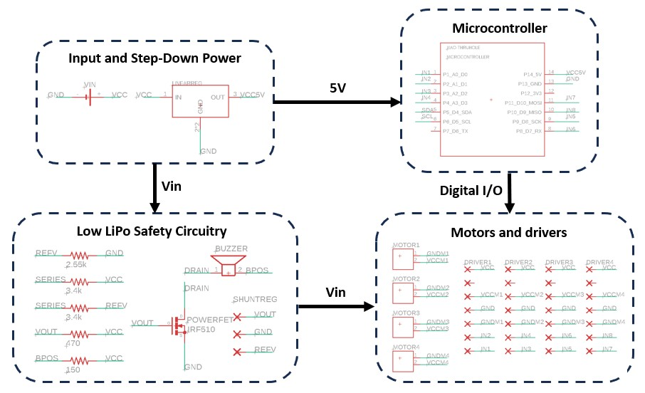
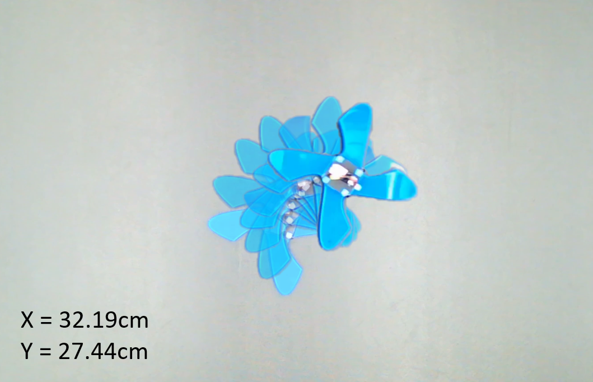
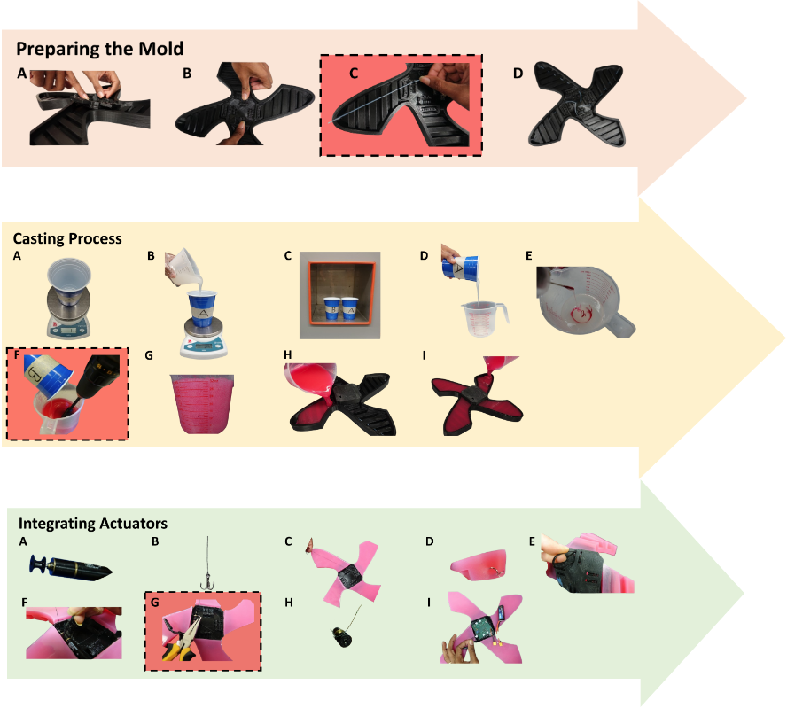

# SoRo-fab: Open-Source Fabrication for Motor-Tendon Actuated Soft Robots

[](https://arxiv.org)
[]()

This repository provides a detailed, standardized fabrication methodology for creating untethered terrestrial soft robots (uTerreSoRo) with comprehensive documentation of design principles, manufacturing best practices, and performance evaluation frameworks.  This is supplementary material for the in-progress paper **An Open-Source Fabrication Strategy and Repeatability Analysis for Motor-Tendon Actuated (MTA) Soft Robots** that will be submitted soon.


---

## Overview

> **Work in Progress**: This repository is being actively developed alongside the paper submission process. Additional materials including CAD files, detailed fabrication guides, and extended documentation will be added progressively. Star/watch this repository for updates!

Soft robotics is a rapidly advancing field, but soft robots (SoRos) remain rare in everyday applications due to complexities in design and lack of consistency in fabrication techniques. Unlike rigid robots with standardized manufacturing pipelines, SoRos still lack broadly adopted methodologies and transparent reporting of fabrication practices.

This work addresses these challenges by providing:

- **Detailed fabrication methodology** for motor-tendon actuated soft robots
- **Critical design principles** including cavity optimization and bio-inspired stiffness gradients  
- **Best practices** for motor anchoring and rigid-soft integration
- **Comprehensive repeatability and reproducibility analysis** across multiple prototypes
- **Task-based performance evaluation** with statistical validation

---

## Repository Structure

```
SoRo-fab/
├── PCBs/                     # PCB designs for different iterations
│   ├── KiCAD_3limbs/         # Gerber/drill/schematic files for 3 limb SoRo
│   ├── KiCAD_4limbs/         # Gerber/drill/schematic files for 4 limb SoRo
│   └── RSC_4limb_big_mode/   # Design files for in-person large 4 limb PCB fab
├── design_files/             # CAD files of hub, hub cap, and mold + pulley (coming soon)
├── experiments/              # Experimental data and analysis scripts
│   ├── raw_data/             # Marker tracking data
│   ├── analysis/             # Python covariance confidence ellipse code
│   └── statistical_tests/    # (Coming soon) Repeatability/reproducibility analysis
├── media/                    # Images, videos, and supplementary materials
└── README.md                 # This file

Coming Soon:
├── fabrication_guide/         # Detailed step-by-step instructions
├── firmware/                  # Microcontroller code and gait sequences
└── docs/                      # Extended documentation
```

---

## Current Repository Contents

### design/
CAD files for SoRo
- Semi-flexible hub with motor mating and ziptie holes
- Hub cap for sealing with cable hole
- Battery enclosure
- Limb mold (coming soon)
- Pulley (coming soon)


### PCBs/
Custom 2-layer PCB design for the uTerreSoRo control system:
- Gerber files for manufacturing (in-person fab lab and external manufacturer)
- Schematic diagrams showing circuit design
- Board layouts
- Drill files

**Key Features**:
- Seeeduino XIAO integration
- 4x TB6643KQ motor driver support
- I2C interface for 6-axis IMU
- LiPo battery management enables tetherless capabilities
- Compact design fits in central hub



### experiments/
Experimental data and analysis code for repeatability/reproducibility evaluation:
- Gait-based twist locomotion data
- Covariance confidence ellipse script for consistency analysis

**Includes**: Data from all three independently fabricated prototypes (Blue, Black, Purple)



### media/
Visual documentation of the fabrication process and robot performance:
- Fabrication process step-by-step photos
- Completed robot prototype images
- Supplementary materials for the paper


---

## Getting Started

### Prerequisites

**Materials**
- Dragon Skin Silicone Rubber (30A shore hardness) for limbs
- NinjaFlex TPU (85A shore hardness) for hub
- nGen filament for molds
- Braided fishing line (high-strength) for tendons
- PTFE tubing for tendon paths
- Two-pronged fishing hooks for tendon anchoring

**Equipment**
- 3D printer
- Vacuum chamber
- Power drill with mixing attachment
- Mold release agent
- Scale (accurate to 1g)
- Zip ties and pliers

**Electronics** 
- Seeeduino XIAO microcontroller
- 4x Maxon DC motors
- 4x TB6643KQ full-bridge motor drivers
- 5V voltage regulator
- IRF510 power MOSFET
- shunt regulator
- buzzer
- resistors
- JST connectors
- 11.4V 1.1Ah LiPo battery (3-cell)
- Custom PCB

### Installation

1. **Clone the repository**
   ```bash
   git clone https://github.com/lefaris/SoRo-fab.git
   cd SoRo-fab
   ```

2. **Explore existing materials**
   - PCB designs are in `PCBs/`
   - Hub files are in `design/`
   - Experimental data and analysis scripts in `experiments/`
   - Images and videos in `media/`

3. **Coming soon**
   - CAD files for molds
   - Detailed fabrication guide with photos
   - Firmware and control code
   - Extended documentation

**Note**: This repository is actively being developed. Additional materials including fabrication guides and firmware will be added as the paper progresses through review.

---

## Citation

If you use this fabrication methodology in your research, please cite (coming soon)